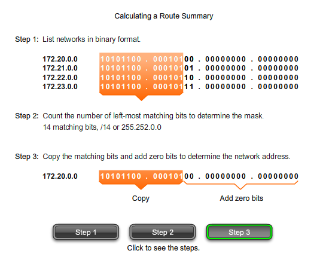
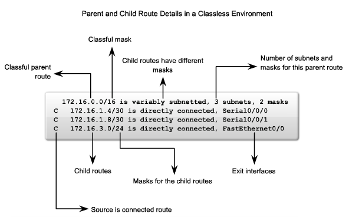
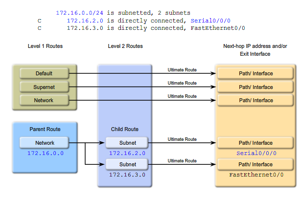

% Cisco Curriculum - Zusammenfassung
% 18.07.2014

# 1 Introduction to Routing and Packet Forwarding

## Router:

* verantwortlich für die Auslieferung von Paketen über verschiedene Netzwerke. Dazu gehört es
	* den besten Pfad ausfindig zu machen und
	* Pakete weiterzuleiten
* müssen Pakete entpacken und (in ein eventuell andersartiges Paket) verpacken

### Hardware des Routers

* CPU
* RAM; speichert:
	* OS
	* Running Configuration File (`running-config`)
	* IP Routing Table
	* ARP Cache
	* Packet Buffer
* ROM; speichert (bei Cisco-Routern):
	* bootstrap instructions
	* grundlegende Diagnosesoftware
	* vereinfachte Version von IOS
* Flash Memory; speichert:
	* OS
* NVRAM (Nonvolatile RAM); speichert (bei Cisco-Routern):
	* Startup Configuration File (`startup-config`)

### Cisco Internetwork Operating System (IOS)

* multitasking-fähig

#### Bootvorgang

1. POST
	* Selbsttest (testet Hardware)
	* Diagnoseprogramme (im ROM gespeichert) werden ausgeführt
2. Bootstrap-Programm laden
	* Bootstrap von ROM in RAM kopieren und ausführen
	* Hauptaufgabe: IOS finden und in den RAM laden
3. IOS finden und laden
	* IOS ist üblicherweise im Flash gespeichert, kann aber auch auf einem TFTP (Trivial File Transfer Protocol) Server gespeichert werden
	* Wenn kein (oder ein unvollständiges) IOS Image gefunden werden kann, wir eine vereinfachte Version aus dem ROM geladen
		* Diese Version kann verwendet werden um Probleme zu diagnostizieren
4. Startup Configuration File finden und laden oder in den `setup-mode` wechseln
	* enthält:
		* Interface-Adressen
		* Routing-Informationen
		* Passwörter
		* Alle anderen Konfigurationen, die vom Netzwerkadministrator vorgenommen wurden
	* wird als `running-config` in den RAM kopiert
	* Wenn keine `running-config` vorhanden ist, wird gefragt, ob in den `setup-mode` gewechselt werden soll
		* Wenn nicht in `setup-mode` gewechselt wird, wird eine default `running-config` verwendet

`Router#show version` (kann verwendet werden um die grundsätzliche Hard- und Software zu überprüfen)

**Weiter bei 1.1.5 Router Interfaces**

# 2 Timm

# 3 Ahmed

# 4 Ahmed

# 5 Leo

# 6 Yunus

# 6 VLSM and CIDR

* vlsm variable length subnet masing (für classles)
* private netze und vlsm-> mehr hosts möglich
* Netzklassen Prinzip: 0 /8, 10 /16, 110 /24, 1110, 1111
	* A (0xxx.xxxx.xxxx.xxxx) **0**.0.0.0 - **127**.255.255.255) /8
	* B (10xx.xxxx.xxxx.xxxx **128.0.0.0 - **191**.255.255.255) /16
	* C (110xx.xxxx.xxxx.xxxx **192**.0.0.0 - **223**.255.255.255) /24
	* Multicast (1110.xxxx.xxxx.xxxx **224**.0.0.0 - **239**.255.255.255)
	* Experimental (1111.xxxx.xxxx.xxxx **240**.0.0.0 - 255.255.255.255)
	* maske ur für classful relevant
* summarize beispiel:
	* 172.16.0.0/16 | 172.17.0.0/16 | 172.18.0.0/16 | 172.19.0.0/16
	* => 172.16.0.0/14, 2 bits benötigz um von .16 zu .19 zu kommen
* CIDR = summarization
* CIDR ignoriert die vorgaben der Netzklassen

# 8 Routing Table: A Closer Look

* show ip route -> directly connected, static, dynamic router added/deleted from routing table, jetzt wirds genauer
* cisco routing table ist classful vom design (s. Level 1,2)
* Routen haben level
	* Level 1: Maske gleich oder kleiner als Netzklassenmaske (in netz A /1-/8, in B /1-/16, ..)
		* entweder Default Route (static route mit IP 0.0.0.0)
		* oder Supernet route (route mit maske kleiner (also auch ungleich) der netzklassenmaske
		* oder Network route (route mit gleicher maske wie Netzklasse)
		* und parent route (s. bild 2, zeile über child route), wenn subnetz iner classful(d.h. maske größer Netzmaske erstellt wird wird diese automatisch miterstellt. Dient nur zum zeigen, dass Level 2-routen folgen.
* Level 2: Subnet des classful (d.h. maske gröer netzmaske)
	* child route (s. bild 2)
* levelunabhängig
	* Ultimate Route: next-hop ist ein interface oder eine IP
* steht beim parent in der table **variable** subnetted besitzen die childs verschiedene Masken
<<<<<<< HEAD:cisco-13-2.md

=======

>>>>>>> FETCH_HEAD:cisco.md

* beste übereinstimmung (ip's) bedeutet längste übereinstimmung
* ist das exit interface eine IP, wird ein rekursives lookup durchgeführt
* um netze mit verschiedenen masken auch classful zu realisieren: static/default routes
* bei calssful behavior (behavior != protocol; behavior ist "globbal setting: `ip classless`") wird die default route nicht immer genommen: wenn eine parent route passt(bedingung einfach), aber keine child route(genaue bedingung) wird die default route nicht genommen, da die parent route "passt" --> drop
* bei classless behavior nimmt er wenn er kein passendes child hat doch eine supernet oder eine default route

# 7 Leo

# 8 Yunus
