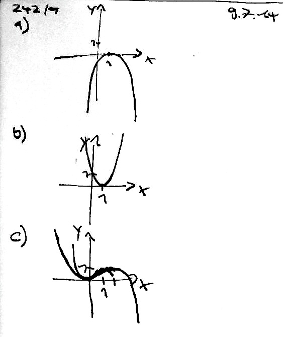
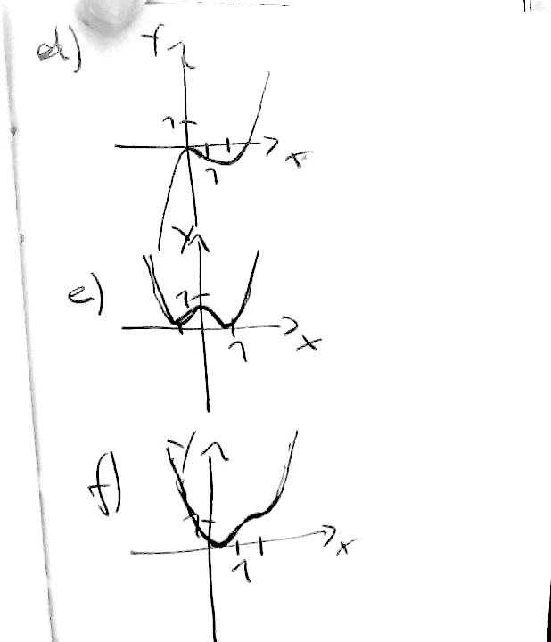

% Mathematik - Unterichtsmitschriften
% Timm Albers
% 19.06.2014 - 10.07-2014

# Matrizen

## 431/2

**19.06.2014**

### a)

M mit *MA = A*, *AM = A*.

### b)

$$
E_n =
\begin{pmatrix}
  1 & 0 & \cdots & 0 \\
  0 & 1 & \cdots & 0 \\
  \vdots & \vdots & \ddots & \vdots \\
  0 & 0 & \cdots & 1
\end{pmatrix}
$$$$
A = (a_{ij}) = 
\begin{pmatrix}
  a_{11} & a_{12} & \cdots & a_{1m} \\
  a_{21} & a_{22} & \cdots & a_{2m} \\
  \vdots & \vdots & \ddots & \vdots \\
  a_{n1} & a_{n2} & \cdots & a_{nm}
\end{pmatrix}
$$$$
A E_{m} =
\begin{pmatrix}
  a_{11} & a_{12} & \cdots & a_{1m} \\
  a_{21} & a_{22} & \cdots & a_{2m} \\
  \vdots & \vdots & \ddots & \vdots \\
  a_{n1} & a_{n2} & \cdots & a_{nm}
\end{pmatrix} =
A
$$$$
E_{n} A = A \quad \text{(wie oben)}
$$

## 431/3

**19.06.2014**

### a)

$$
A B = B A = E_3 \quad \text{A und B sind zueinander invers}
$$

#### Nebenbetrachtung

##### Addition

$$
a + (-a) = 0  \quad \text{a und (-a) sind zueinander invers; 0 ist das neutrale Element}
$$

##### Multiplikation

$$
a {1 \over a} = 1  \quad \text{a und (1/a) sind zueinander invers; 1 ist das neutrale Element}
$$

### b)

$$
A =
\begin{pmatrix}
  2 & 1 \\
  -1 & -1
\end{pmatrix}
$$$$
B \text{ gesucht mit } A B = E_2
$$$$
B =
\begin{pmatrix}
  a & b \\
  c & d
\end{pmatrix} =
\begin{pmatrix}
  1 & 1 \\
  -1 & -2
\end{pmatrix}
$$$$
A B = E_2
$$$$
A B =
\begin{pmatrix}
  2a+c & 2b+d \\
  -a-c & -b-d
\end{pmatrix} =
\begin{pmatrix}
  1 & 0 \\
  0 & 1
\end{pmatrix}
$$$$
2a+c = 1
$$$$
2b+d = 0
$$$$
-a-c = 0
$$$$
-b-d = 1
$$

=> lösen (z.B. Additionsverfahren)

## Abbildungen mit Matrizen

**19.06.2014**

[Skizze]()

---

$$
f(x) = x \quad \text{(Identität)}
$$$$
y = x
$$$$
\vec{x} = \lambda {(1 \choose 1)}
$$$$
d = d'
$$

---

$$
P(3 | 1)
$$$$
P'(1 | 3)
$$$$
Q(x_1 | y_1)
$$$$
Q'(y_1 | x_1)
$$

---

[Skizze]()

$$
g: \vec{x} = {\lambda {1 \choose 2}} \quad \text{(Ursprungsgerade)}
$$$$
P(4 | 3)
$$$$
P'(0 | 5)
$$

---

$$
P(p_1 | p_2)
$$$$
g: \vec{x} = {\lambda {r_1 \choose r_2}}
$$$$
\text{Lotgerade (duch P und P } \perp \text{ g)}
$$$$
{r_1 \choose r_2} {l_1 \choose l_2} = 0
$$$$
r_1 l_1 + r_2 l_2 = 0
$$

z.B.

$$
l_1 = r_2
$$$$
l_2 = -r_1
$$$$
{r_1 \choose r_2} {r_2 \choose -r_1} = 0
$$$$
({r_2 \choose -r_1} \quad \text{Richtungsvektor für l})
$$$$
l: \vec{x} = {p_1 \choose p_2} + \lambda {r_2 \choose -r_1}
$$

Schnittpunkt F berechnen durch Gleichsetzen

$$
\lambda_1 {r_1 \choose r_2} = {p_1 \choose p_2} + \lambda_2 {r_2 \choose -r_1}
$$$$
\lambda_1 = {{p_1 r_1 + p_2 r_2} \over {r_1^2 + 2_2^2}}
$$$$
\lambda_2 = {{p_2 r_1 - p_1 r_2} \over {r_1^2 + r_2^2}}
$$$$
\vec{OP'} = {p_1 \choose p_2} + 2 \lambda_2 {r_2 \choose -r_1}
$$$$
\vec{OP'} = {p_1 \choose p_2} + 2 {{p_2 r_1 - p_1 r_2} \over {r_1^2 + r_2^2}} {r_2 \choose -r_1}
$$$$
\vec{OP'} = {1 \over {r_1^2 + r_2^2}} {{(r_1^2 - r_2^2) p_1 + 2 r_1 r_2 p_2} \choose {2 r_1 r_2 p_1 + (r_2^2 - r_1^2) p_2}}
$$$$
\vec{OP'} = {1 \over {r_1^2 + r_2^2}}
\begin{pmatrix}
  r_1^2 - r_2^2 & 2 r_1 r_2 \\
  2 r_1 r_2 & r_2^2 - r_1^2
\end{pmatrix} {p_1 \choose p_2}
$$

$$
({1 \over {r_1^2 + r_2^2}}
\begin{pmatrix}
  r_1^2 - r_2^2 & 2 r_1 r_2 \\
  2 r_1 r_2 & r_2^2 - r_1^2
\end{pmatrix}) \quad (\text{Transformationsmatrix für eine Spiegelung an } \vec{x} = \lambda {r_1 \choose r_2})
$$

**HA:** Rechnung mit allen Zwischenschritten rechnen!

## 435/3

**02.07.2014**

### a)

$$
\vec{OP} = {x \choose y}
$$$$
\vec{OP'} = ? \quad \text{gedreht um 90 Grad}
$$$$
M = ?
$$$$
M * \vec{OP} = \vec{OP'}
$$$$
\vec{OP'} = {-y \choose x}
$$$$
M_{90} = 
\begin{pmatrix}
  {-{y \over x}} & 0 \\
  0 & {x \over y}
\end{pmatrix} =
\begin{pmatrix}
  0 & -1 \\
  1 & 0
\end{pmatrix}
$$

### b)

$$
\vec{OP''} = {-x \choose -y} \quad \text{gedreht um 180 Grad}
$$$$
M_{180} = 
\begin{pmatrix}
  -1 & 0 \\
  0 & -1
\end{pmatrix}
$$

### c)

$$
\vec{OP'''} = {y \choose -x} \quad \text{gedreht um 270 Grad}
$$$$
M_{180} = 
\begin{pmatrix}
  {y \over x} & 0 \\
  0 & {-{x \over y}}
\end{pmatrix} = 
\begin{pmatrix}
  0 & 1 \\
  -1 & 0
\end{pmatrix}
$$

## 435/4

**02.07.2014**

$$
\vec{OP} = {x \choose y} = {r \cos{\alpha} \choose r \sin{\alpha}}
$$$$
M * \vec{OP} = \vec{OP'}
$$$$
x = r \cos{\alpha}
$$$$
y = r \sin{\alpha}
$$$$
\vec{OP'} = {{r (\cos{\alpha + \varphi})} \choose {r (\sin{\alpha + \varphi})}} = {{r (\cos{\alpha} \cos{\varphi} - \sin{\alpha} \sin{\varphi})} \choose r (\sin{\alpha} \cos{\varphi} + \cos{\alpha} \sin{\varphi})}
$$$$
M = 
\begin{pmatrix}
  {r (\cos{\alpha} \cos{\varphi} - \sin{\alpha} \sin{\varphi}) \over r \cos{\alpha}} & 0 \\
  0 & {r (\sin{\alpha} \cos{\varphi} + \cos{\alpha} \sin{\varphi}) \over r \sin{\alpha}}
\end{pmatrix} =
\begin{pmatrix}
  {r (\cos{\alpha + \varphi}) \over r \cos{\alpha}} & 0 \\
  0 & {r (\sin{\alpha + \varphi}) \over r \sin{\alpha}}
\end{pmatrix}
$$$$
\alpha = \tan^{-1} {x \over y}
$$$$
r = \sqrt{x^2 + y^2}
$$$$
M =
\begin{pmatrix}
  {\sqrt{x^2 + y^2} \cos{(\tan^{-1} {x \over y} + \varphi)}} \over {\sqrt{x^2 + y^2} - \cos{(\tan^{-1} {x \over y})}} & 0 \\
  0 & {\sqrt{x^2 + y^2} \sin{(\tan^{-1} {x \over y} + \varphi)}} \over {\sqrt{x^2 + y^2} - \sin{(\tan^{-1} {x \over y})}}
\end{pmatrix}
$$$$
M =
\begin{pmatrix}
  {\cos{(\tan^{-1} {x \over y} + \varphi)}} \over {\cos{(\tan^{-1} {x \over y})}} & 0 \\
  0 & {\sin{(\tan^{-1} {x \over y} + \varphi)}} \over {\sin{(\tan^{-1} {x \over y})}}
\end{pmatrix}
$$$$
M =
\begin{pmatrix}
  {\cos{(\tan^{-1} {x \over y}) \cos{\varphi}} - \sin{(\tan^{-1} {x \over y}) \sin{\varphi}}} \over {\cos{(\tan^{-1} {x \over y})}} & 0 \\
  0 & {\sin{(\tan^{-1} {x \over y}) \cos{\varphi}} - \cos{(\tan^{-1} {x \over y}) \sin{\varphi}}} \over {\sin{(\tan^{-1} {x \over y})}} 
\end{pmatrix}
$$$$
M =
\begin{pmatrix}
  \cos{\varphi} - {{\sin{(\tan^{-1} {x \over y}) \sin{\varphi}} \over \cos{(\tan^{-1} {x \over y})}}} & 0 \\
  0 & \cos{\varphi} - {{\cos{(\tan^{-1} {x \over y}) \sin{\varphi}} \over \sin{(\tan^{-1} {x \over y})}}}
\end{pmatrix}
$$

### Neuer Ansatz

$$
M =
\begin{pmatrix}
  {r \cos{\alpha} \cos{\varphi} - r \sin{\alpha} \sin{\varphi}} \over {r \cos{\alpha}} & 0 \\
  0 & ...
\end{pmatrix}
$$$$
M =
\begin{pmatrix}
  {r \cos{\alpha} \cos{\varphi} - r \sin{\alpha} \sin{\varphi}} \over {r x} & 0 \\
  0 & ...
\end{pmatrix}
$$$$
M =
\begin{pmatrix}
  {x \cos{\varphi} - y \sin{\varphi}} \over {r x} & 0 \\
  0 & {x \sin{\varphi} - y \cos{\varphi}} \over {r y}
\end{pmatrix}
$$$$
\vec{OP'} = {{x \cos{\varphi} - y \sin{\varphi}} \choose {x \sin{\varphi} + y \cos{\varphi}}}
$$$$
M =
\begin{pmatrix}
  \cos{\varphi} & -\sin{\varphi} \\
  \sin{\varphi} & \cos{\varphi}
\end{pmatrix}
$$

# Integralrechnung

## Aufgabe
**08.07.2014**

Bestimmen Sie den Flächeninhalt zwischen 0 und 1 zwischen $$f(x)=x^2$$ und der x-Achse näherungsweise.

(Untersumme)

$$
a = 0 \quad \text{Start}
$$$$
b = 1 \quad \text{Ende}
$$$$
f(x) = x^2 \quad \text{Funktion}
$$$$
n = 10 \quad \text{Anzahl der Rechtecke}
$$$$
h = {b-a \over n}
$$$$
A = h f(0) + h f(h) + h f(2h) + ... + h f((n-1) h)
$$$$
A = h (f(0) + f(h) + f(2h) + ... + f((n-1) h))
$$$$
A = (\sum_{i=0}^{n=1} f(ih)) h
$$

## Bestimmtes Integral

$$
\lim_{n \to \infty} (\sum_{i=0}^{n=1} f(ih)) = \int_a^b f(x) \mathrm{d}x
$$

**gesprochen:** Integral von a bis b über f(x) dx

## Vergleich mit dem Differentialquotienten

$$
\lim_{\Delta x \to 0} {\Delta y \over \Delta x} \quad \text{Grenzwert des Differenzenquotienten}
$$$$
{= \lim_{h \to 0} {f(x) - f(x + h) \over h}}
$$$$
{= {\mathrm{d} f(x) \over \mathrm{d}x}} \quad \text{Differentialquotient (gesprochen d f von x nach dx)}
$$

## Hauptsatz der Differenzial- und Integralrechnung

Ist die Funktion f stetig, so ist die Integralfunktion Ia mit

$$
I_a(x) = \int_a^b f(t) \mathrm{d}t
$$

differenzierbar und die Ableitung ist gleich der Integralfunktion f:

$$
I_a'(x) = f(x)
$$

---

**09.07.2014**

$$
I_a(x) = \int_a^x f(t) \mathrm{d}t
$$$$
I_a'(x) = {\mathrm{d} I_a(x) \over \mathrm{d}x} = f(x)
$$

### Beweis

[Tafelbild](res/mathe/2014-07-09-tafel-1.jpg)

$$
I_a'(x) = {\lim_{h \to 0} {I_a(x+h) - I_a(x) \over h}}
$$$$
{= \lim_{h \to 0} {\int_a^{x+h} f(t) \mathrm{d}t - \int_a^x f(t) \mathrm{d}t \over h}}
$$$$
{= \lim_{h \to 0} {{\int_x^{x+h} f(t) \mathrm{d}t} \over h} = \lim_{h \to 0} {f(z) h \over h} = \lim_{h \to 0} f(z) = f(x)} \quad \text{q.e.d.}
$$

grobe Näherung für

$$
\int_x^{x+h} f(t) \mathrm{d}t \quad \text{ist} \quad f(z) h
$$

mit

$$
x \leq z \leq x+h
$$

wobei für h gegen 0 dann z gegen x läuft und f(z) gegen f(x).

(siehe Tafelbild)

### Aufgabe 224/2

[Tafelbild](res/mathe/2014-07-09-tafel-2.jpg)

### Aufgabe 242/5

## Stammfunktion

**10.07.2014**

### Definition

Die Integralfunktion

$$
I_0(x)
$$

zur Integrantenfunktion

$$
f(x)
$$

wird eine *Stammfunktion* genannt.

### Notation

*F(x)* Stammfunktion zu *f(x)* (d.h. *F'(x) = f(x)*)

### Zusatz

$$
F(x) = I_0(x) + c
$$

(*c* = Integrationskonstante)

weil konstante Summanden beim Ableiten wegfallen:

$$
F'(x) = I_0'(x)
$$

### Aufgabe 242/6

#### a)

$$
f(t) = 2t - 4
$$$$
I_0(t) = t^2 - 4 t
$$

#### b)

$$
f(t) = 60 t + 200
$$$$
I_0(t) = 30 t^2 + 200 t
$$

#### c)

$$
f(t) = 3 t^2
$$$$
I_0(t) = t^3
$$

#### d)

$$
f(t) = 4 t^3
$$$$
I_0(t) = t^4
$$

### Aufgabe

Bestimmen Sie

$$
A = \int_{-1}^1 f(x) \mathrm{d}x \quad \text{mit } f(x) = x^3 - x
$$$$
F(x) = {1 \over 4} x^4 - {1 \over 2} x^2 + c
$$$$
A = \int_{-1}^1 {x^3 - x \mathrm{d}x}
$$$$
A = [{1 \over 4} x^4 - {1 \over 2} x^2 + c]_{-1}^1 \quad \text{(Schreibweise für Bereich)}
$$$$
A = {1 \over 4} 1^4 - {1 \over 2} 1^2 + c - {({1 \over 4} (-1)^4 - {1 \over 2} (-1)^2 + c)}
$$$$
A = 0
$$

**Begriff:** orientierter Flächeninhalt (positiv wie negativ)

---

**16.07.2014**

---

**17.07.2014**

# Klausurbesprechung: Analytische Geometrie / lineare Algebra (26.06.2014)

## Aufgabe 1

### a)

$$
g_p: \vec{x} = \lambda
\begin{pmatrix}
  24 \\
  28 \\
  6
\end{pmatrix}
$$

z.Z. $g_p$ und $g_w$ windschief

* weder parallel
* noch Schnittpunkt

#### Schnittpunkt?

$$
g_w: \vec{x} = 
\begin{pmatrix}
  20 \\
  20 \\
  5
\end{pmatrix} + t
\begin{pmatrix}
  {-1} \\
  2 \\
  1
\end{pmatrix}
$$

#### Gleichsetzen:

$$
\text{I   | } 20 - t = 24 \lambda
$$$$
\text{II  | } 20 + 2t = 18 \lambda
$$$$
\text{III | } 5 + t = 6 \lambda
$$$$
25 = 39 \lambda
$$$$
\lambda = {25 \over 30} = {5 \over 6}
$$$$
\text{in II } 20 + 2 t = 18 \cdot {5 \over 6} = {{18 \cdot 5} \over {6}} = 15
$$$$
20 + 2 t = 15
$$$$
2 t = -5
$$$$
t = - {5 \over 2}
$$$$
\text{t und } \lambda \text{ in I } 20 - (- {5 \over 2}) =? 24 {5 \over 6}
$$$$
20 + {5 \over 2} =! {{24 \cdot 5} \over {6}} = 20
$$

### b)

#### gesucht:

$$
E_p \text{ in Koordinatenform}
$$$$
E_p: \vec{x} =
\begin{pmatrix}
  0 \\
  0 \\
  0
\end{pmatrix} + \lambda
\begin{pmatrix}
  24 \\
  18 \\
  6
\end{pmatrix} + \mu
\begin{pmatrix}
  {-1} \\
  2 \\
  1
\end{pmatrix}
$$$$
\begin{pmatrix}
  24 \\
  18 \\
  6
\end{pmatrix} x
\begin{pmatrix}
  {-1} \\
  2 \\
  1
\end{pmatrix} =
\begin{pmatrix}
  6 \\
  {-30} \\
  66
\end{pmatrix} =
\begin{pmatrix}
  1 \\
  {-5} \\
  11
\end{pmatrix}
$$$$
\vec{n} = 
\begin{pmatrix}
  1 \\
  {-5} \\
  11
\end{pmatrix} =
{{\begin{pmatrix}
  24 \\
  18 \\
  6
\end{pmatrix} x
\begin{pmatrix}
  {-1} \\
  2 \\
  1
\end{pmatrix}} \over 6}
$$$$
E_p: x_1 - 5 x_2 + 11 x_3 = \vec{n} \cdot \vec{s_0} = 0
$$

#### Abstand

$$
P =
\begin{pmatrix}
  20 \\
  20 \\
  5
\end{pmatrix}
$$$$
A =
\begin{pmatrix}
  0 \\
  0 \\
  0
\end{pmatrix}
$$$$
\vec{AP} =
\begin{pmatrix}
  {-20} \\
  {-20} \\
  {-5}
\end{pmatrix} \quad \text{Vektor von P in die Ebene}
$$$$
d = | \vec{AP} \cdot \vec{n_0} |
$$$$
d = |
\begin{pmatrix}
  {-20} \\
  {-20} \\
  {-5}
\end{pmatrix} \cdot
{\begin{pmatrix}
  1 \\
  {-5} \\
  11
\end{pmatrix} \over \sqrt{147}} |
$$$$
d \approx 2,06 LE
$$

## Aufgabe 2

### a)

(Übergangsdiagramm)

$$
M =
\begin{pmatrix}
  0,7 & 0,1 \\
  0,3 & 0,9
\end{pmatrix}
$$$$
v_1 = M \cdot v_0
$$$$
v_1 =
\begin{pmatrix}
  0,7 & 0,1 \\
  0,3 & 0,9
\end{pmatrix} \cdot
\begin{pmatrix}
  300 \\
  300
\end{pmatrix} =
\begin{pmatrix}
  240 \\
  360
\end{pmatrix}
$$

### b)

$$
v_2 = M \cdot v_1 = 
\begin{pmatrix}
  204 \\
  396
\end{pmatrix}
$$$$
v_3 = M \cdot v_2 =
\begin{pmatrix}
  182,4 \\
  417,6
\end{pmatrix}
$$

### c)

$$
\begin{pmatrix}
  a & b \\
  c & d
\end{pmatrix} \cdot
\begin{pmatrix}
  240 \\
  360
\end{pmatrix} =
\begin{pmatrix}
  240 \\
  360
\end{pmatrix}
$$$$
\text{I   | } 240 a + 360 b = 240
$$$$
\text{II  | } 240 c + 360 d = 360
$$$$
\text{III | } a + c = 1
$$$$
\text{IV  | } b + d = 1
$$

$$
\text{I   | } 2 a + 3 b = 2
$$$$
\text{II  | } 2 c + 3 d = 3
$$$$
\text{III | } a + c = 1
$$$$
\text{IV  | } b + d = 1
$$$$
a = 1 - c
$$$$
b = 1 - d
$$$$
2 (1 - c) + 3 (1 - d) = 2
$$$$
2 c + 3 d = 3
$$$$
a = {{3 d - 1} \over 2}
$$$$
c = {{3 - 3 d} \over 2}
$$

---

**22.07.2014**

# Wiederholung vom 10.07.2014

## Aufgabe 242/5

## Stammfunktion

## Aufgabe 242/6

---

# Aufgabe 245/5

Geben Sie eine Stammfunktion zu der gegebenen Funktion an.

## a)

$$
f(x) = 3 x^2
$$$$
I_0(x) = x^3
$$

## b)

$$
g(x) = - {1 \over 2} x^3
$$$$
I_0(x) = - {1 \over 8} x^4
$$

## c)

$$
h(t) = a^2 \cdot t^2
$$$$
I_0(t) = {{1 \over 3} a^2} \cdot t^3
$$

## d)

$$
k(t) = - \sin{t}
$$$$
I_0(t) = \cos{t}
$$

# Aufgabe 245/6

Geben Sie eine Stammfunktion an.

## a)

$$
f(x) = 1 - x^2 + x^4 - x^6
$$$$
I_0(x) = x - {2 \over 3} x^3 + {4 \over 5} x^5 - {6 \over 7} x^7
$$

## b)

$$
g(x) = {1 \over {x^2}} + \sqrt{2} \cdot x^2
$$$$
I_0(x) = {1 \over {{2 \over 3} x^3}} + {{\sqrt{2}} \over 3} x^3
$$

## c)

$$
h(a) = k \cdot \sqrt{a}
$$$$
h(a) = k \cdot a^{1 \over 2}
$$$$
I_0(a) = {1 \over 3} a^{3 \over 2}
$$

## d)

$$
k(x) = x^{c - 1} + 2 x^{c-2} - x^c
$$$$
I_0(x) = {1 \over c} x^c + {2 \over {c-1}} x^{c-1} - {1 \over {c+1}} x^{c+1}
$$

## e)

$$
y_1(x) = 2 \sin{x} - 3 \cos{x}
$$$$
I_0(x) = - 2 cos{x} - 3 \sin{x}
$$

## f)

$$
p(t) = k \cdot {1 \over {\sqrt{t}}} - \sqrt{1}
$$$$
p(t) = k \cdot t \cdot {1 \over { {1 \over 3} t^{3 \over 2} } } - {1 \over {\sqrt{1}+1}} a^{\sqrt{1}+1}
$$

# Aufgabe 246/10

---

**22.07.2014**

# Bestimmtes Integral

Sei $F(x)$ eine Stammfunktion von $f(x)$, so ist $\int_a^b {f(x)} = [F(x)]_a^b = F(b) - F(a)$ das bestimmte Integral über $f(x)$.

# Unbestimmtes Integral

Sei $F(x)$ eine Stammfunktion von $f(x)$, so ist $\int {f(x) \mathrm{d}x} = F(x) + c, c \in \mathbb{R}$ das unbestimmte Integral von $f(x)$.

# Satz: Faktorregel für Integrale

$$
\int_a^b {k \cdot f(x) \mathrm{d}x} = k \cdot \int_a^b {f(x) \mathrm{d}x}
$$

# Satz: Summenregel für Integrale

$$
\int_a^b {(f(x) + g(x)) \mathrm{d}x} = \int_a^b {f(x) \mathrm{d}x} + \int_a^b {g(x) \mathrm{d}x}
$$

# Satz: Allgemeine Intervaladditivität

Sei $a$, $b$, $c$ beliebig: $\int_a^b {f(x) \mathrm{d}x} + \int_b^c {f(x) \mathrm{d}x} = \int_a^c {f(x) \mathrm{d}x}$

# 249/5